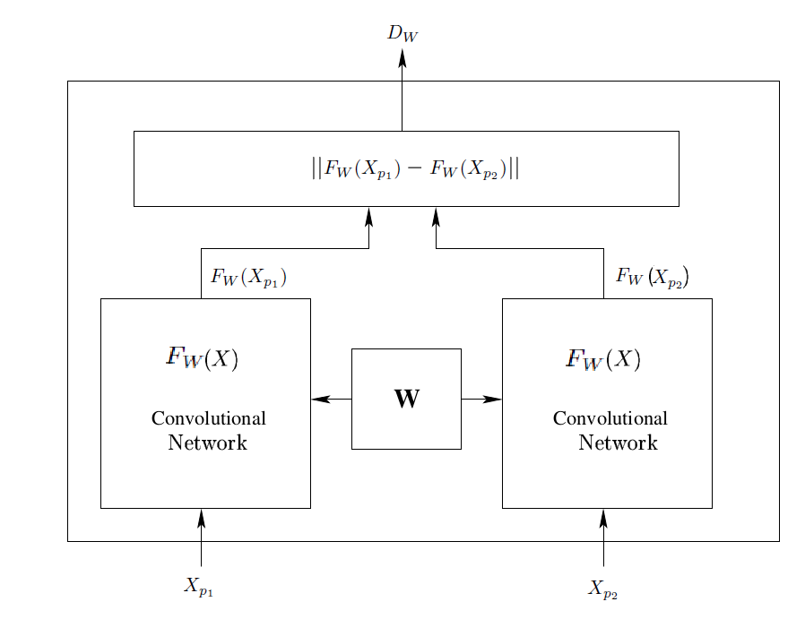
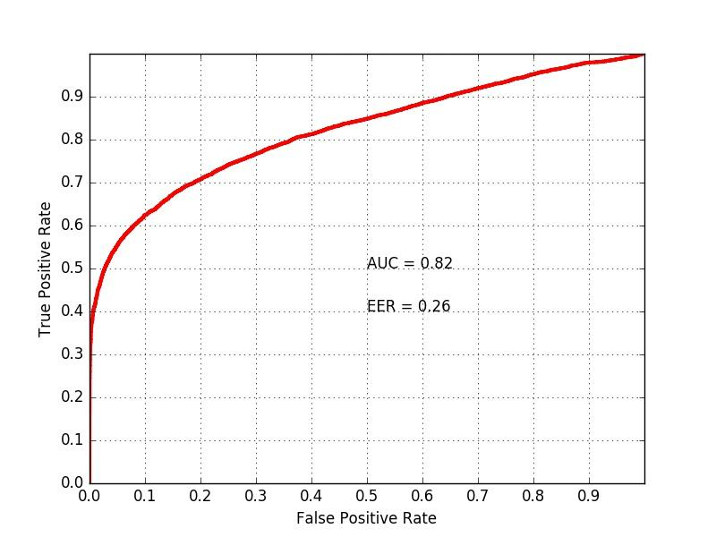
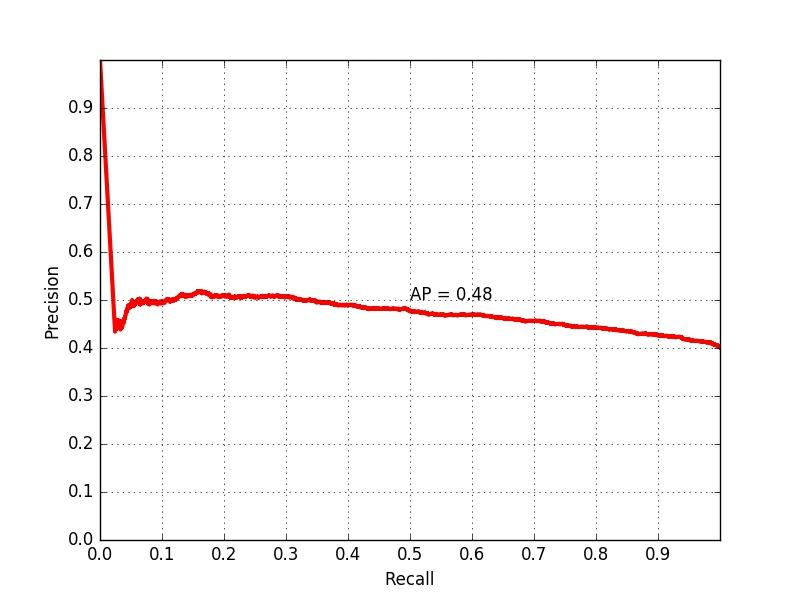
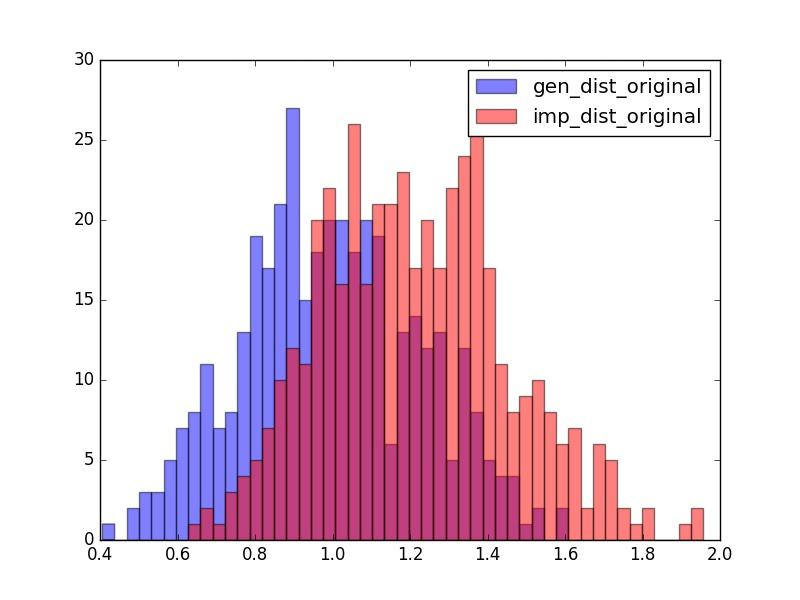

# Siamese Architecture Using Convolutional Neural Networks

This repository is dedicated to desing and implement the Siamese architecture using the Convolutional Neural Networks. 
`TensorFlow` is the framework used for design and the input data format is `HDF5` however basically the data format can be 
anything if supported by the `Tensorflow`.

## Introduction to Siamese Architecture

In the recent years, a great amount of research in the
computer vision and pattern recognition area has been dedicated to biometrics whose assumption is the uniqueness of
people's identity. An important application of biometrics is
the problem of face verification. One of the applications,
for instance, is whether the designed system can recognize
a pair of face images belonging to the same person. Distinguishing between identical twins is classified as one of
the most difficult scenarios which is reported to be hard and
complicated even for humans. Deep learning is a solution for creating a framework to do the task.

The availability of abundant data and a reliable structure are prerequisites for deep learning. In different face
 verification tasks there might
be numerous subjects with only a few of their im-
age pairs per subject available for training. Since in the face verification problem, the focus is not classification, there is a need to develop new
architectures to be trained only for distinguishing between
genuine and impostor pairs regardless of their identities. A
genuine pair is a pair of images in which the images belong
to the same subject and an impostor pair is otherwise.

The main idea is to implement an architecture named "Siamese Network" for face verification. The goal is to learn a nonlinear mapping that learns a similarity metric from the data itself for face verification which suggests a more data-driven
solution compared to the traditional facial texture analysis methods. This architecture can be learned on pairs of
data and later to be used for distinguishing between subjects which have never been seen in the training phase. Another
advantage is that since the similarity metric will be learned using this architecture, as long as we have enough training
data (genuine and impostor pairs) the number of training samples per subject does not affect the identification performance and that is an interesting advantage.

## Overview

The aim is to design a siamese convolutional neural network using `TensorFlow`. The tutorial is aimed to sketch a starup model to the the two follwing:

1. Define an organization for the network architecture, training and evaluation phases.
2. Provides a template framework for constructing larger and more complicated models.

## Model Architecture

Two simple `convolutional layers`(each have max pooling) followed by two `fully-cnnected` layers conisdered. The whole structure is followed by a `contrastive loss` function which is aimed to create a discriminative output subspace.

## Code Organization

The source code is embeded in `code` folder.

| File                  | Explanation   |
| ----------------------|:-------------:|
| Siamese_Architecture.py  | The body of the framework which consists of structure and axillary functions |
| SiameseCNN.py         | The main file which has to be run |

## Input

The input format is `HDF5` for this implemetation but it basically can be anything as long as it satisfies the shape properties. For each `TRAIN` and `TEST` data, there are attributes call `cube` and `label`. The `cube` is the data of the shape `(Number_Samples,height,width,2*Number_Channels)` and the `label` is of the form `(Number_Samples,1)` in which each row has the class label. The reason behind `2*Number_Channels` for the fourth dimension is that the last dimension(fourth one) include the pairs by nature, i.e., [:,:,:,0:Number_Channels] are all left parts of the pairs and [:,:,:,Number_Channels:] are all right parts of the pairs.

## Training

As conventional procedure, updating the gradient is done with batches of the data. Moreover Batch Normalization has been implemented for each convolutional layer. No Batch Normalization is done for the fully-connected layers. For all the convolutional and fully-connected layers, the drop-out has been used with the same parameter however this parameter can be customized for each layer in the code. Traditional GradientDescentOptimizer has been used.


## Architecture and Extracted Fatures

The is to implement and train a `Siamese architecture` using `two identical deep Convolutional Neural
Networks (CNN)` to find a nonlinear mapping where in the mapped target subspace a simple `distance metric` can be
used for performing the face verification task. So in the target subspace the genuine pairs should be as close as possible and the impostor pairs should be as far as possible using simple distance metrics (i.e., Euclidean distance). The architecture 
is as below:
<p align="center">
  <b>link to the originial paper:</b><br>
  <a href="http://yann.lecun.com/exdb/publis/pdf/chopra-05.pdf">paper</a>
  <br><br>

</p>


Recent researchs in computer vision has demonstrated the superior performance of deep models with `global features` compared
to `local features`. Therefore, we have used the whole face as the input feature space (using global features) rather than
using different hand-crafted features or facial landmarks for training the deep model.

## Package Requirements

This software has been written using Twnsorflow version `0.11.0rc0` and `Python 2.7`. If you want to check the version of 
your installed TensorFlow open the terminal and by typing `python` active you python environment. Then you have to import Tensorflow:
```
import tensorflow as tf
```

Now for cheching the version just type `tf.__version__` and enter!

## Running the Program

The file `SiameseCNN.py` must be run. The `siamese.py` file contains required methods and the structure of the network.
The `siamese.py` file can be modified separately without affecting the main file `SiameseCNN.py`.

## Evaluation Metrics

Since the task is face verification which is in the catoegory of binary classifcation, [`ROC`](https://en.wikipedia.org/wiki/Receiver_operating_characteristic) curve has been chosen to demostate the verification accuracy. A technical issue is that when the ration of impostor/genuine pairs are far from 1, the `ROC` curve can be misleading. The more precise metric to evaluate the verification task is [`Precision-Recall`](https://en.wikipedia.org/wiki/Precision_and_recall) curve which has been used too in the 
implementation. The output can be as the following:

<p align="center">
 
</p>

The last important demostration of the results is to plot the [`distribution histogram`](https://en.wikipedia.org/wiki/Histogram). This histogram
demonstrates the input and output distrubutions of the feature and proves whether the structure would succeed in the discriminataion task or not. If successful, the output feature distribution must at least have less overlap than input or
 ideally completely separated.
 
 <p align="center">

</p>


